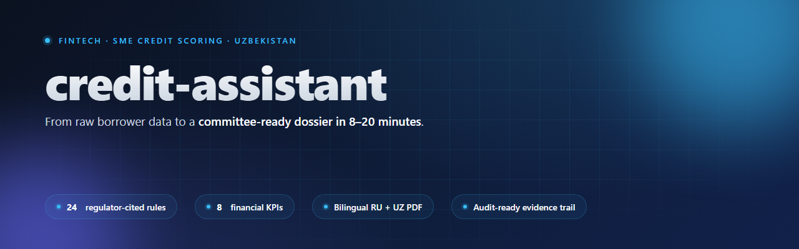
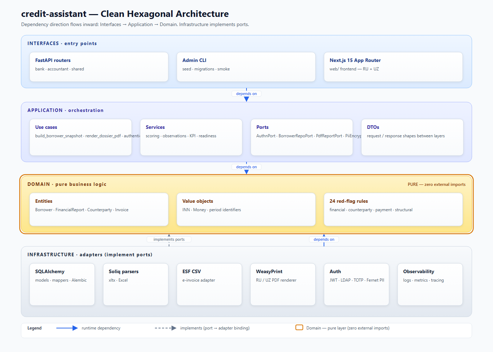

# credit-assistant



**24 verified business rules** · **8 financial KPIs** · **1,310 tests** · **0.75 s PDF render** · **8.5 / 10 independent audit**

> *Production-grade SME credit scoring tool for Uzbek commercial banks — from raw borrower data to a committee-ready dossier in 8 to 20 minutes.*

       

Credit-assistant helps bank credit analysts evaluate SME loan applications end-to-end, from raw borrower data to a signed dossier. It is built for mid-tier Uzbek commercial banks that lend to small and medium businesses but lack the in-house digital tooling of larger players. The system runs 24 verified business rules and 8 financial KPIs over consolidated borrower data and produces a risk score plus a bilingual RU/UZ PDF dossier ready for the credit committee. Every value on screen and in the PDF carries a source trail back to the original document or rule reference.

## Why this exists

Credit analysts at mid-tier Uzbek banks currently spend 2 to 4 hours per dossier manually compiling borrower data: cross-referencing Soliq tax exports, ESF e-invoices, financial statements, and GNK certificates, then transcribing the results into a committee-ready file. Credit-assistant cuts that work to 8 to 20 minutes while preserving audit-ready provenance — rule sources, evidence numbers, and source-trail chips attached to every field. It is designed to slot into mid-tier banks behind their existing core systems and close the digitalization gap they face against larger competitors like TBC and Kapitalbank.

## Architecture

The codebase follows Clean / Hexagonal layering with a strict inward dependency direction: `interfaces/` and `infrastructure/` depend on `application/`, which depends on `domain/`. `domain/` is pure Python business logic — no SQLAlchemy, no FastAPI, no I/O imports. Ports (abstract interfaces) live in `application/ports/`; concrete adapters in `infrastructure/` implement them, and the composition root wires them via dependency injection. Verified by import-graph: `domain/` imports zero modules from `infrastructure/` or `application/`.

[](docs/screenshots/architecture.svg)

<sup>High-resolution: [architecture.svg](docs/screenshots/architecture.svg) · regenerate via `python scripts/_build_architecture_svg.py`</sup>

### Two patterns the rest of the codebase repeats

The 24 red-flag rules and 8 financial KPIs are not magical — they are pure functions on a frozen `BorrowerSnapshot`, with no I/O, no globals, and no exceptions-as-control-flow. Here is one of each, verbatim from `src/`, so a reader can copy the pattern instead of guessing what production-grade looks like in this codebase.

### How a rule looks in code — `DSCR_LOW`

[`src/domain/rules/financial/dscr_low.py`](src/domain/rules/financial/dscr_low.py) fires when Debt Service Coverage Ratio falls below 1.3 — the borrower's operating cash flow is not enough to cover annual interest plus principal repayment. Three things to look at:

1. **`RULE_SOURCE` comment** ties the 1.3 threshold to a citable source (Murodov 2025 peer-reviewed UZ research + IFC SME Knowledge Guide ch.4). No hand-wavy «industry standard» — every threshold in this repo points at a paper, regulator circular, or Basel reference.
2. **Return type `FiringEvidence | None`** — the function never raises; either it has enough data to fire and returns evidence with the actual numbers, or it has missing data and returns `None`. No partial answers, no silent zeros.
3. **Fallback chain OCF → EBITDA → EBIT** — if the borrower's statements lack operating cash flow, the rule degrades to EBITDA, then EBIT, and tells the analyst which numerator it used. Partial financial data still surfaces the risk signal instead of swallowing it.

```python
"""DSCR_LOW: Debt Service Coverage Ratio ниже минимума 1.3 (ADR-0024)."""

# RULE_SOURCE: Murodov O.J. (2025). «Хлопкоочистительные предприятия Узбекистана:
#   оценка кредитоспособности и пороги DSCR» // Tashkent State University of Economics.
#   Эмпирический минимум DSCR≥1.3 для МСБ-cotton ginning. Cross-reference:
#   Investopedia DSCR formula, IFC SME Knowledge Guide chapter 4 (DSCR≥1.25
#   minimum, ≥1.5 comfort).
# CONFIDENCE: HIGH (peer-reviewed UZ-specific research + multilateral cross-check)

from decimal import Decimal
from domain.entities.borrower_snapshot import BorrowerSnapshot
from domain.rules.protocol import FiringEvidence

DSCR_MIN_THRESHOLD = Decimal("1.3")
MONTHS_IN_YEAR = Decimal("12")


def dscr_low(snapshot: BorrowerSnapshot) -> FiringEvidence | None:
    """DSCR = OCF / (interest + annualized principal). Fires when DSCR < 1.3."""
    loan = snapshot.loan_request
    if loan is None or loan.term_months <= 0:
        return None
    if not snapshot.annual_reports:
        return None
    latest = max(snapshot.annual_reports, key=lambda r: r.period.end)
    interest = latest.interest_expense
    if interest is None:
        return None

    # Numerator: OCF → EBITDA → EBIT (best-effort fallback chain).
    if latest.operating_cash_flow is not None:
        numerator, numerator_source = latest.operating_cash_flow.amount, "OCF"
    elif latest.profit_before_tax is not None and latest.depreciation_amortization is not None:
        numerator = latest.profit_before_tax.amount + interest.amount + latest.depreciation_amortization.amount
        numerator_source = "EBITDA"
    elif latest.profit_before_tax is not None:
        numerator = latest.profit_before_tax.amount + interest.amount
        numerator_source = "EBIT"
    else:
        return None

    principal_annual = loan.amount.amount * MONTHS_IN_YEAR / Decimal(loan.term_months)
    debt_service = interest.amount + principal_annual
    if debt_service <= Decimal(0):
        return None
    dscr = numerator / debt_service
    if dscr >= DSCR_MIN_THRESHOLD:
        return None

    return FiringEvidence(
        message=f"DSCR = {dscr:.2f} (минимум 1,3) при покрытии через {numerator_source}",
        evidence={"dscr": str(dscr.quantize(Decimal('0.01'))), "numerator_source": numerator_source, ...},
    )
```

### How a KPI looks in code — `fx_exposure_ratio`

[`src/application/services/kpi_calculator.py`](src/application/services/kpi_calculator.py) computes the share of FX-denominated liabilities in total liabilities — a leading indicator for currency mismatch risk in Uzbek SME lending. The same purity contract applies, plus one deliberate engineering choice worth pointing out:

**`level_tone=None`** — the function returns the ratio without a colour band (good / warn / bad). The reason is honest: there is no verified Central Bank of Uzbekistan threshold for FX-exposure of SME borrowers yet. Rather than invent a number that looks authoritative on a credit committee printout, we render the value plain and let the banker apply professional judgment. This «no fabricated thresholds» discipline is enforced repo-wide — when a regulator source surfaces, the colour band is added in a separate commit with the citation.

```python
def _compute_fx_exposure_ratio(latest: FinancialReport | None) -> KpiValue | None:
    """FX Exposure = liabilities_fx / liabilities × 100 (PCT scale).

    Без level_tone v1: пороги отложены до verified § ЦБ РУз для FX-mismatch у МСБ.
    Banker reads the number and applies professional judgment — мы не плодим
    фабрикованные threshold'ы (lesson Qwen industry medians).
    """
    if latest is None or latest.balance_end is None:
        return None
    liabilities = _money_amount(latest.balance_end.liabilities)
    liabilities_fx = _money_amount(latest.balance_end.liabilities_fx)
    if liabilities is None or liabilities_fx is None:
        return None  # silent on baseline where banker did not fill FX-component
    if liabilities <= 0:
        return None  # divide-by-zero guard
    ratio_pct = liabilities_fx / liabilities * Decimal(100)
    return KpiValue(value=ratio_pct, unit=KpiUnit.PCT, yoy_pct=None, sparkline=())
    # level_tone=None — see module-level note re backlog ЦБ РУз threshold
```

_Both functions are typical, not cherry-picked — every rule in [`src/domain/rules/`](src/domain/rules/) has a `RULE_SOURCE` comment, every KPI in [`src/application/services/kpi_calculator.py`](src/application/services/kpi_calculator.py) follows the silent-on-missing-data contract. The discipline is in the repo, not the README._

## By the numbers

| Metric | Value |
|---|---|
| Business rules (regulator-cited) | 24 verified |
| Financial KPIs (with confidence layer) | 8 |
| Tests passing | 1310 (1087 backend pytest + 230 frontend vitest) |
| PII columns encrypted at rest | 6 (Fernet/MultiFernet rotation) |
| PDF render time (demo dossier) | 0.75 s |
| Dossier list query latency | 10 ms (single JOIN, no N+1) |
| Demo dossiers | 52 anonymized + 5 walkthrough scenarios |
| Migrations head | `b04677374b85` |
| Languages | RU + UZ (Latin), bilingual PDF + UI |

Each rule cites a specific regulator source (ЦБ РУз №2696, НК РУз, FATF, Basel III, EAG typology, IFC SME, Murodov 2025). Every PDF evidence block carries the rule source plus the actual numbers pulled from the snapshot — no narrative without provenance. Domain layer ships with zero external dependencies (verified via import graph).

## Quick start

Three steps, ~5 minutes on a clean Docker host.

```bash
# 1. Clone & configure secrets
git clone https://github.com/RiobVO/credit-assistant.git
cd credit-assistant
cp .env.example .env
# Edit .env:
#   JWT_SECRET     — generate with `openssl rand -hex 32`
#   PII_ENC_KEYS   — generate with `python -c "from cryptography.fernet import Fernet; print(Fernet.generate_key().decode())"`
#   BRAND_ID       — defaults to "default" (bank mode), set to a config/brands/<id>.json key for multi-tenant

# 2. Start the full stack (api + postgres + redis + web)
docker compose up -d

# 3. Apply migrations + seed demo data
docker compose exec api uv run alembic upgrade head
docker compose exec api bash -c "cd /app && PYTHONPATH=/app/src uv run python scripts/seed_demo_borrowers.py"

# 4. Open
open http://localhost:3000
# Login:  t04@bank.uz  /  T04Smoke!
```

### Verifying it works

```bash
# Backend health + OpenAPI
curl -s http://localhost:8000/health
open http://localhost:8000/docs

# Run the test suite (ruff + mypy --strict + pytest)
docker compose exec api bash -c "cd /app && uv run python -m ruff check . && uv run python -m mypy --strict src tests && uv run python -m pytest"
```

## Built with

- **Plain stack, no exotic deps** — FastAPI · SQLAlchemy 2.0 (async) · Pydantic v2 · Alembic · Next.js 15 (App Router) · TypeScript strict · shadcn/ui · Tailwind 4 · React Query · zod · WeasyPrint · pytest · vitest · ruff · mypy `--strict`.
- **No SaaS dependencies in the data path** — bank deployments are on-premise behind their own perimeter; no telemetry calls out.
- **Architecture-first discipline** — 24 ADRs in `docs/adr/`, active contracts in `docs/conventions/active-contracts.md`, every rule with a regulator citation in its module docstring. See [ADR-0024](docs/adr/0024-foundational-source-verification.md) for how the rule set was triangulated against multiple independent sources.

## License

This project is licensed under the MIT License — see [`LICENSE`](LICENSE) for full text. You may freely use, modify, and redistribute the code under the terms in `LICENSE`.

## Contact

- **Email** — `eleru340@gmail.com` 
- **Telegram** — `plssog`
- **Location** — Tashkent, Uzbekistan
