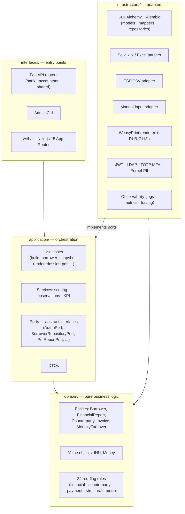

# credit-assistant

> *Production-grade SME credit scoring tool for Uzbek commercial banks. Built solo in 4 weeks via AI orchestration.*

       

Credit-assistant helps bank credit analysts evaluate SME loan applications end-to-end, from raw borrower data to a signed dossier. It is built for mid-tier Uzbek commercial banks that lend to small and medium businesses but lack the in-house digital tooling of larger players. The system runs 24 verified business rules and 8 financial KPIs over consolidated borrower data and produces a risk score plus a bilingual RU/UZ PDF dossier ready for the credit committee. Every value on screen and in the PDF carries a source trail back to the original document or rule reference.

## Why this exists

Credit analysts at mid-tier Uzbek banks currently spend 2 to 4 hours per dossier manually compiling borrower data: cross-referencing Soliq tax exports, ESF e-invoices, financial statements, and GNK certificates, then transcribing the results into a committee-ready file. Credit-assistant cuts that work to 8 to 20 minutes while preserving audit-ready provenance — rule sources, evidence numbers, and source-trail chips attached to every field. It is designed to slot into mid-tier banks behind their existing core systems and close the digitalization gap they face against larger competitors like TBC and Kapitalbank.

## Architecture

The codebase follows Clean / Hexagonal layering with a strict inward dependency direction: `interfaces/` and `infrastructure/` depend on `application/`, which depends on `domain/`. `domain/` is pure Python business logic — no SQLAlchemy, no FastAPI, no I/O imports. Ports (abstract interfaces) live in `application/ports/`; concrete adapters in `infrastructure/` implement them, and the composition root wires them via dependency injection. Verified by import-graph: `domain/` imports zero modules from `infrastructure/` or `application/`.



## Project structure

```
src/
├── domain/                # Pure business logic, no I/O imports
│   ├── entities/          # Borrower, FinancialReport, Counterparty, Invoice, MonthlyTurnover, TaxEvent, VATPeriodReport, RedFlag
│   ├── value_objects/     # INN, Money, period identifiers
│   ├── rules/             # 24 red-flag rules: financial · counterparty · payment_discipline · structural · meta
│   └── services/          # Domain services (scoring math, ratio computation)
│
├── application/           # Use cases, ports, DTOs — orchestration only
│   ├── use_cases/         # build_borrower_snapshot · assess_draft_readiness · render_dossier_pdf · authenticate_analyst · parse_manual_input_files
│   ├── services/          # Cross-use-case helpers (KPI level_tone, observations)
│   ├── ports/             # AuthnPort · BorrowerRepositoryPort · DossierRepositoryPort · DraftRepositoryPort · PdfReportPort · PiiEncryptorPort · RefreshTokenDenylistPort
│   └── dto/               # Request / response shapes between layers
│
├── infrastructure/        # I/O implementations of application ports
│   ├── persistence/       # SQLAlchemy models · mappers · repositories · Alembic migrations · Fernet-encrypted JSONB types
│   ├── adapters/          # soliq_xltx · soliq_excel · esf_csv · manual_input · tax_calendar
│   ├── auth/              # JWT · LDAP3 · TOTP MFA · password hashing · break-glass · refresh-token denylist
│   ├── reports/pdf/       # WeasyPrint dossier renderer
│   ├── i18n/              # RU + UZ message bundles for PDF / API
│   ├── encryption/        # Fernet PII envelope (multi-key rotation)
│   ├── brand/             # Multi-tenant brand resolver
│   ├── catalog/           # OKED, USD-rate, industry-median lookups
│   ├── rules/             # YAML rule loader + verified-citation registry
│   └── observability/     # Structured logs · Prometheus metrics · OTel tracing · correlation-id
│
└── interfaces/
    ├── api/               # FastAPI: bank/ · accountant/ · shared/ routers + middleware
    └── cli/               # Admin / smoke / migration CLI

web/src/                   # Next.js 15 App Router frontend (Bank + Accountant UIs)
├── app/                   # Route groups · API route handlers · login · dossier · manual-input
├── features/              # dossier · manual-input · search · history · settings · help
├── components/            # Shared shells (section-card, modal, KPI tiles)
├── lib/                   # api · auth · mfa · brand-context · app-mode · locale-cookie
└── i18n/                  # ru.json + uz.json (next-intl)

docs/
├── adr/                   # 24 Architecture Decision Records
├── audit/                 # Independent multi-subagent audits (honesty · security · architecture · demo · docs)
├── operations/            # Smoke playbooks, 2FA smoke, runbooks (PII rotation, multi-tenant, LDAP)
├── compliance/            # Bank tender pack — admin-guide · security-architecture · DRP/BCP (bilingual RU+UZ)
├── conventions/           # Active contracts (CA-001 .. CA-070+) — live domain/persistence/rules/UI invariants
├── demo/                  # Demo scenarios + variant previews
└── session-log.md         # Per-session/day chronology with commit hashes and lessons

config/
├── rules/                 # YAML rule definitions with verified citations (v1_uz_msb.yaml — 24 rules)
├── brands/                # Multi-tenant brand configs
├── okved/                 # OKED industry catalog
├── exchange/              # USD rate snapshots
├── pdf-i18n/              # RU + UZ message bundles for PDF rendering
└── benchmarks/            # Industry-median catalogs

tests/                     # Integration / e2e — mirror of src/; unit tests live co-located inside src/ as *_test.py
```

## By the numbers

| Metric | Value |
|---|---|
| Build time | 4 weeks, solo, via AI orchestration |
| Business rules (regulator-cited) | 24 verified |
| Financial KPIs (with confidence layer) | 8 |
| Tests passing | 1310 (1087 backend pytest + 230 frontend vitest) |
| PII columns encrypted at rest | 6 (Fernet/MultiFernet rotation) |
| PDF render time (demo dossier) | 0.75 s |
| Dossier list query latency | 10 ms (single JOIN, no N+1) |
| Demo dossiers | 52 anonymized + 5 walkthrough scenarios |
| Migrations head | `b04677374b85` |
| Languages | RU + UZ (Latin), bilingual PDF + UI |

Each rule cites a specific regulator source (ЦБ РУз №2696, НК РУз, FATF, Basel III, EAG typology, IFC SME, Murodov 2025). Every PDF evidence block carries the rule source plus the actual numbers pulled from the snapshot — no narrative without provenance. Domain layer ships with zero external dependencies (verified via import graph).

## Quick start

Three steps, ~5 minutes on a clean Docker host.

```bash
# 1. Clone & configure secrets
git clone https://github.com/RiobVO/credit-assistant.git
cd credit-assistant
cp .env.example .env
# Edit .env:
#   JWT_SECRET     — generate with `openssl rand -hex 32`
#   PII_ENC_KEYS   — generate with `python -c "from cryptography.fernet import Fernet; print(Fernet.generate_key().decode())"`
#   BRAND_ID       — defaults to "default" (bank mode), set to a config/brands/<id>.json key for multi-tenant

# 2. Start the full stack (api + postgres + redis + web)
docker compose up -d

# 3. Apply migrations + seed demo data
docker compose exec api uv run alembic upgrade head
docker compose exec api bash -c "cd /app && PYTHONPATH=/app/src uv run python scripts/seed_demo_borrowers.py"

# 4. Open
open http://localhost:3000
# Login:  t04@bank.uz  /  T04Smoke!
```

### Verifying it works

```bash
# Backend health + OpenAPI
curl -s http://localhost:8000/health
open http://localhost:8000/docs

# Run the test suite (ruff + mypy --strict + pytest)
docker compose exec api bash -c "cd /app && uv run python -m ruff check . && uv run python -m mypy --strict src tests && uv run python -m pytest"
```

## Screenshots

Live screenshots from the demo deployment.

| | |
|---|---|
|  |  |
|  |  |

_Screenshots added post-merge; see [demo scenarios walkthrough](docs/demo/scenarios.md) for the same flows narrated step-by-step._

## Independent audit

On 2026-05-21 I ran a production-readiness audit against my own work — five isolated subagents, each scoped to a single dimension (honesty, security, architecture, demo readiness, documentation), no cross-context between them. Their findings are checked into the repo verbatim.

| Area | Score | Headline |
|---|---|---|
| Architecture & code quality | **8.5 / 10** | Domain purely isolated, mappers symmetric, migrations disciplined |
| Documentation accuracy | **7.5 / 10** | ADRs / session-log / contracts excellent; one stale citation found and fixed |
| Honesty (claims vs reality) | **7.5 / 10** | Persistence/architecture claims hold; one `slowapi` mention in security doc surfaced and corrected |
| Demo readiness | **5.0 / 10** | Works on host but `/history` polluted with test rows; seed not reproducible at pilot bank |
| Security (banker IT-audit) | **5.0 / 10** | Foundations right (encryption, secrets, JWT). Blockers: IDOR, no rate-limit, root container |
| **Overall** | **6.5 / 10** | Above average for a 4-week solo build; below tier-1 bank sign-off bar without a 3–5 day hardening sprint |

> "I built it, then audited it independently, then prioritized the fix list. The audit folder (`docs/audit/2026-05-21/`) ships in the repo — read the security and demo findings before drawing conclusions. Self-aware engineering beats false perfection."

[Full audit summary →](docs/audit/2026-05-21/00-summary.md)
[Top 10 prioritized fixes →](docs/audit/2026-05-21/00-summary.md#top-10-issues--priority-ranked-severity--impact)

## What's NOT built (deferred for post-pilot)

This is a 4-week solo build, not a tier-1 bank production deployment. Below are the items the independent audit flagged as deferred work — documented, prioritized, not hidden.

| Item | Severity | Effort | Where it's tracked |
|---|---|---|---|
| Row-level authorization (IDOR on dossier endpoints) | Critical | ~4h | Audit issue #1 |
| Rate-limiting on `/login` / `/refresh` / `/mfa/challenge` | Critical | ~6h | Audit issue #2 |
| API container non-root user (CIS Docker §4.1) | Critical | ~1h | Audit issue #4 |
| JWT secret strength validation at boot | Critical | ~1h | Audit issue #5 |
| Reproducible demo seed (deterministic BR-2026-NNNN scenarios) | Blocker | ~3-4h | Audit issue #6 |
| `--proxy-headers` for forensic-grade audit-log IPs | High | ~30m | Audit issue #7 |
| Backup encryption (current dumps plaintext) | High | ~2h | Audit issue #8 |
| Audit-log coverage on state-changing endpoints (GNK upload, soliq upload, drafts) | High | ~3h | Audit issue #9 |
| `/history` cleanup (test rows from smoke iterations) | High | ~1h | Audit issue #10 |
| Pentest certificate + Uzbekistan ПДн attestation | T4 compliance | ~2mo lead | `docs/compliance/` |
| Encrypted borrower INN column | Defense-in-depth | — | Audit notable mentions |

Each item lives in `docs/audit/2026-05-21/00-summary.md` with severity rationale and concrete fix path. Sequenced cleanup sprint = 3-5 working days.

## Built with

- **[Claude Code](https://www.anthropic.com/claude-code)** (Anthropic) — primary IDE; all 1310 tests, 24 ADRs, and migrations drafted via AI orchestration with strict TDD and architecture-first discipline. See [ADR-0024](docs/adr/0024-foundational-source-verification.md) for methodology — three-way independent research (Claude, ChatGPT, Qwen) reconciled into a single rule set with verified regulator citations.
- **Plain stack, no exotic deps** — FastAPI · SQLAlchemy 2.0 (async) · Pydantic v2 · Alembic · Next.js 15 (App Router) · TypeScript strict · shadcn/ui · Tailwind 4 · React Query · zod · WeasyPrint · pytest · vitest · ruff · mypy `--strict`.
- **No SaaS dependencies in the data path** — bank deployments are on-premise behind their own perimeter; no telemetry calls out.

## License

This project is licensed under the MIT License — see [`LICENSE`](LICENSE) for full text.

The code is the author's IP; banks receive a right-to-use under separate agreement.

## Contact

- **Email** — `<your-email>` _(user fills in)_
- **LinkedIn** — `<linkedin URL>` _(user fills in)_
- **Location** — Tashkent, Uzbekistan
