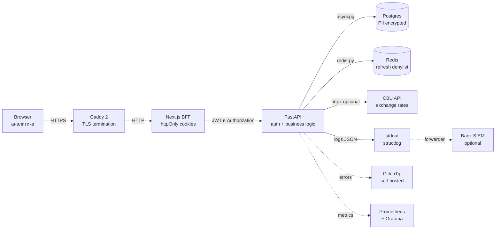

# Security Architecture

> Архитектура безопасности Credit Assistant MSB. Аудитория — CISO / Security
> Officer банка-клиента, аудиторы.
>
> **Документ — draft skeleton (T4 compliance pack).** Версия 0.1, требует
> финальной редактуры (включая pentest results) перед передачей в банк.

---

## Russian

### 1. Обзор и допущения

**Deployment model:** on-premise, single-tenant per deployment. Каждый банк
получает изолированную инсталляцию в своём периметре. Multi-tenancy
реализуется через отдельные compose-projects, не shared instance (ADR-0018).

**Допущения по периметру:**

- Сетевой периметр банка (firewall, VPN) — ответственность банка.
- Физический доступ к серверам — ответственность банка.
- Контроль доступа к Docker host (SSH, sudo) — ответственность банка.
- Vault для секретов — ответственность банка (наша рекомендация HashiCorp
  Vault или эквивалент).

### 2. Threat model

**OWASP Top 10 mapping:**

| OWASP risk | Mitigation |
|------------|------------|
| A01:2021 Broken Access Control | JWT + role check + `Depends(get_current_analyst)` на всех endpoint'ах bank mode |
| A02:2021 Cryptographic Failures | bcrypt cost 12, Fernet PII encryption, HTTPS-only (Caddy) |
| A03:2021 Injection | SQLAlchemy ORM (no raw SQL), Pydantic validation на всех inputs |
| A04:2021 Insecure Design | Threat modeling до implementation, regular review |
| A05:2021 Security Misconfiguration | `.env.example` без секретов, prod startup-asserts на mandatory env |
| A06:2021 Vulnerable Components | `uv lock` pinning, periodic SCA scan (pre-pilot recommended) |
| A07:2021 Identification/Authn Failures | TOTP MFA + bcrypt cost=12 (≈250 ms/попытка). Rate limiting и account lockout на post-pilot roadmap. |
| A08:2021 Software/Data Integrity | Container image signing (recommended), backup restore drill |
| A09:2021 Logging/Monitoring Failures | structlog + correlation_id + GlitchTip error tracking |
| A10:2021 SSRF | httpx с whitelisted endpoints, no user-controlled URLs |

**Банковские специфики:**

- **Insider threat:** аналитик с легальным доступом скачивает PII заёмщиков.
  Mitigation — audit log append-only, PII masking в logs, role separation.
- **MITM в банковской сети:** Caddy 2 HTTPS обязателен даже на internal
  периметре.
- **Credential stuffing mitigation в v1:** bcrypt cost=12 латенс
  (≈250 ms/попытка) + обязательный MFA. Rate limiting (slowapi) и account
  lockout (failed-attempt counter в `analysts`) — post-pilot hardening
  (ADR создаётся при старте, TODO[CA-rate-limit-adr]). Threat-model:
  TOTP brute-force окно ≈30 мин без rate-limit, поэтому ловится через
  GlitchTip alerts на high `mfa_verify_failed` rate + manual disable.
- **Privileged access escalation:** break-glass list (`ADMIN_BREAK_GLASS_EMAILS`)
  логируется отдельным audit event'ом.

**Out of scope (ответственность банка):**

- Physical security серверов
- Network segmentation банковской сети
- Endpoint security (антивирус, EDR) на машинах аналитиков
- Supply chain security (CI/CD pipeline целостность)

### 3. Authentication chain

**Слой 1 — credentials:**

- **Seeded mode** (default): email + password (bcrypt cost 12) +
  опциональный MFA (TOTP/WebAuthn).
- **LDAP mode**: service-bind → user search → user-bind для verify password.
  Подробности — ADR-0019.

**Слой 2 — MFA:**

- TOTP (RFC 6238) через `pyotp`, secret хранится зашифрованным
  (`analysts.mfa_secret` через Fernet).
- WebAuthn passkeys как альтернатива TOTP — ADR-0012.
- MFA enrollment обязателен для `senior` role, опционален для `analyst`
  (конфигурируется per-brand).

**Слой 3 — tokens:**

- JWT HS256, `JWT_SECRET` ≥32 байта.
- Access token: 15 минут TTL.
- Refresh token: 7 дней TTL, **rotation на каждый `/refresh`** — ADR-0016.
- Redis denylist (`SET NX EX`) для использованных refresh JTI.
- При `REDIS_URL=None` → stateless 7-day fallback (dev only).
- При Redis недоступен в prod → fail closed на `/refresh`.

**Слой 4 — cookies (frontend BFF):**

- `ca_access` (path=`/`) и `ca_refresh` (path=`/api/auth`).
- httpOnly + sameSite=lax + secure (в prod).
- Client JavaScript никогда не видит JWT напрямую.

**Break-glass:**

- Whitelist `ADMIN_BREAK_GLASS_EMAILS` обходит LDAP, использует seeded credentials.
- Каждое использование логируется как `login` event с `authn_source='break_glass'`.

### 4. Authorization model

**Roles:**

- `analyst` — базовая роль, доступ к Bank mode (search, dossier view,
  PDF download) или Accountant mode (upload, view).
- `senior` — расширенные права (audit log просмотр, user management в seeded
  mode).

**Mode gating** (ADR-0009 + ADR-0011):

- `APP_MODE=bank` — все shared endpoints закрыты `Depends(get_current_analyst)`.
- `APP_MODE=accountant` — local-first, упрощённая auth.

**Audit log:**

- Append-only таблица `audit_log`.
- События: `login`, `login_failed`, `logout`, `search_borrower`,
  `view_dossier`, `generate_dossier`, `download_pdf`.
- Каждое событие содержит: actor email (masked), action, resource, timestamp,
  correlation_id, brand_id.
- Email маскируется через `infrastructure/auth/email_mask.py`.
- Indexed по `(brand_id, created_at)` для forensics.

### 5. PII protection

**Encryption at rest** — ADR-0017.

**Зашифрованные колонки (Fernet/MultiFernet через TypeDecorator):**

| Таблица | Колонка | Тип данных |
|---------|---------|-------------|
| `analysts` | `full_name` | string |
| `analysts` | `mfa_secret` | string (base32 TOTP secret) |
| `borrowers` | `director_name` | string |
| `borrower_snapshots` | `payload` | JSONB (wrap pattern) |
| `drafts` | `payload` | JSONB (wrap pattern) |
| `gnk_certificates` | `file_bytes` | bytes (PDF/Excel content) |

**JSONB wrap pattern:** `{"_encrypted": true, "ciphertext": "..."}` —
позволяет grep'ать БД для troubleshooting без расшифровки.

**Backward-compat sentinel:** `gAAAAA` префикс отличает шифрованные значения
от plain (для миграции).

**Key management:**

- `PII_ENC_KEYS` env — comma-separated Fernet keys.
- Primary key (первый в списке) — encrypt + decrypt.
- Fallback keys — только decrypt (для grace-period ротации).
- Production startup-assertion: API падает при отсутствии `PII_ENC_KEYS`.

**Email masking в audit_log:** `u***@bank.uz` — оригинал не сохраняется,
только masked версия для compliance trail.

**Что НЕ шифруется (intentional):**

- ИНН — нужен для индексирования и поиска.
- Имя заёмщика (юр.лица) — публичная информация (open registry).
- Red flag evidence — derived data, не PII.

### 6. Network periphery

**Inbound:**

- Caddy 2 на портах 80/443 — TLS termination + HTTP→HTTPS redirect.
- Auto-renewable Let's Encrypt или банковские внутренние CA.
- Caddyfile с strict cipher suites (TLS 1.2+, no SSLv3/TLS 1.0/1.1).

**Internal:**

- Docker compose isolation — все backend сервисы на internal network.
- API (8000), Postgres (5432), Redis (6379) — НЕ exposed наружу.
- BFF Next.js (3000) — exposed только в dev, в prod проксируется через Caddy.

**Outbound:**

- CBU API (`cbu.uz`) для курсов валют — optional, может работать offline.
- В production **никаких других external API**.
- Scraping `soliq.uz` запрещён (исключение — публичный лукап после legal
  review, CA-DS28).

### 7. Data flow diagram

**Cookie boundaries:**

- `ca_access` и `ca_refresh` — выставляются BFF после successful auth.
- Browser отправляет cookies на BFF, BFF извлекает и пробрасывает в
  `Authorization: Bearer <token>` на FastAPI.
- Client-side JS никогда не видит JWT (httpOnly).

### 8. Cryptography

| Назначение | Алгоритм | Параметры |
|------------|----------|-----------|
| Хеш паролей | bcrypt | cost 12 (~250ms на современном CPU) |
| PII encryption | Fernet (AES-128-CBC + HMAC-SHA256) | 128-bit key |
| JWT signing | HMAC-SHA256 | `JWT_SECRET` ≥32 байт |
| TLS | TLS 1.2+ (Caddy default) | cipher suites — Caddy modern profile |
| TOTP | RFC 6238 (HMAC-SHA1) | 30s window, 6 digits |

**Key sizes:**

- Fernet key: 32 байта (base64 → 44 символа).
- JWT secret: рекомендуется 32+ байта (256+ бит энтропии).
- bcrypt salt: автоматически (16 байт).

### 9. Compliance mapping

#### Закон РУз №547 «О персональных данных»

| Требование | Реализация |
|------------|------------|
| Согласие субъекта на обработку | Аналитик получает согласие на бумаге/в АБС при подаче кредитной заявки; продукт обрабатывает только переданные данные |
| Локализация хранения в РУз | On-premise deployment в банковском ЦОД (РУз) |
| Конфиденциальность ПДн | Fernet encryption at rest (ADR-0017) |
| Право субъекта на удаление | API `DELETE /api/dossier/{id}` (cascade на snapshots/drafts/audit) |
| Уведомление о breach | DRP/BCP playbook (см. `drp-bcp.md`) — эскалация в Security Officer + Госинспекция |
| Audit trail | Append-only `audit_log` с retention ≥3 года |

#### Базель III SREP принципы

| Принцип | Реализация |
|---------|------------|
| Operational risk management | DRP/BCP, RTO/RPO targets, restore drill |
| Internal controls | Audit log, role separation, MFA |
| Data quality | Pydantic validation, parser warnings, source trail |
| IT governance | ADR-документы, change management через git |

#### ЦБ РУз положения

- Положение ЦБ РУз №2696 (lex.uz/ru/docs/2703056) — foundational source
  для 9 правил rules engine v1 (`config/rules/v1_uz_msb.yaml`) после
  ADR-0024.
<!-- ADR-0024 closure: «№27-п» was scrubbed as fabricated source 2026-05-19; рассмотрено Положение №2696 как замену -->

### 10. Secrets management

**Environment variables (`.env` в production):**

- `.env` НИКОГДА не коммитится в git (`.gitignore`).
- `.env.example` с placeholder'ами — в репо.
- В production рекомендуется HashiCorp Vault или эквивалент:
  - `vault kv put secret/credit-assistant JWT_SECRET=... PII_ENC_KEYS=...`
  - Container загружает secrets через Vault Agent sidecar.

**Rotation procedures:**

| Secret | Cadence | Procedure |
|--------|---------|-----------|
| `PII_ENC_KEYS` | annually | `docs/operations/pii-key-rotation.md` |
| `JWT_SECRET` | annually | rotate → restart → all sessions invalidated |
| `LDAP_BIND_PASSWORD` | quarterly | sync с AD ops, restart API |
| Postgres password | annually | rotate → update `DATABASE_URL` → restart |
| Backup encryption key | annually | re-encrypt existing backups |

**Audit:**

- Все secret access события (Vault) логируются в банковский SIEM.
- Каждая rotation документируется (timestamp, operator, reason).

---

## O'zbek

> Eslatma: ushbu bo'lim mashinaviy tarjima asosida tayyorlangan skelet.
> Har bir bo'limga `TODO[CA-T4-UZ]` belgisi qo'yilgan — yakuniy tahrir
> uchun o'zbek mutaxassisi kerak.

### 1. Umumiy ko'rinish va taxminlar

`TODO[CA-T4-UZ]: trebuetsya ruchnaya redaktura uzbekskogo eksperta`

On-premise joylashtirish modeli, har bir bank uchun alohida instansiya.
Multi-tenancy alohida compose-projectlar orqali amalga oshiriladi (ADR-0018).

### 2. Tahdid modeli

`TODO[CA-T4-UZ]: trebuetsya ruchnaya redaktura uzbekskogo eksperta`

OWASP Top 10 mapping, bank-spetsifik tahdidlar (insider threat, MITM,
credential stuffing), bank javobgarligi zonasi.

### 3. Autentifikatsiya zanjiri

`TODO[CA-T4-UZ]: trebuetsya ruchnaya redaktura uzbekskogo eksperta`

To'rt qatlam: credentials (bcrypt/LDAP), MFA (TOTP/WebAuthn), tokenlar
(JWT HS256, refresh rotation ADR-0016), cookies (httpOnly BFF).

### 4. Avtorizatsiya modeli

`TODO[CA-T4-UZ]: trebuetsya ruchnaya redaktura uzbekskogo eksperta`

Rollar: `analyst` va `senior`. Mode gating ADR-0009 + ADR-0011 bo'yicha.
Append-only `audit_log` jadvali compliance trail uchun.

### 5. PII himoyasi

`TODO[CA-T4-UZ]: trebuetsya ruchnaya redaktura uzbekskogo eksperta`

Fernet/MultiFernet at-rest shifrlash — 6 ta ustun (ADR-0017). JSONB wrap
pattern. `PII_ENC_KEYS` environment variable orqali kalit boshqaruvi.

### 6. Tarmoq perimetri

`TODO[CA-T4-UZ]: trebuetsya ruchnaya redaktura uzbekskogo eksperta`

Caddy 2 TLS termination, Docker compose izolatsiyasi, production-da hech
qanday tashqi API yo'q (CBU dan boshqa, ixtiyoriy).

### 7. Ma'lumotlar oqimi diagrammasi

`TODO[CA-T4-UZ]: trebuetsya ruchnaya redaktura uzbekskogo eksperta`

Mermaid diagrammasi yuqoridagi RU bo'limida. Browser → Caddy → BFF → API →
Postgres/Redis. Cookie chegaralari httpOnly.

### 8. Kriptografiya

`TODO[CA-T4-UZ]: trebuetsya ruchnaya redaktura uzbekskogo eksperta`

bcrypt cost 12, Fernet AES-128-CBC + HMAC-SHA256, JWT HS256 ≥32 bayt,
TLS 1.2+, TOTP RFC 6238.

### 9. Compliance mapping

`TODO[CA-T4-UZ]: trebuetsya ruchnaya redaktura uzbekskogo eksperta`

№547-sonli Qonun (PDn), Bazel III SREP, MB RUz №2696-sonli nizomi
(lex.uz/ru/docs/2703056). Har bir talab — implementatsiya mapping.
<!-- ADR-0024 closure: «№27-p» soxta manba sifatida 2026-05-19 olib tashlandi; o'rniga №2696 nizomi qo'llaniladi -->

### 10. Sirlarni boshqarish

`TODO[CA-T4-UZ]: trebuetsya ruchnaya redaktura uzbekskogo eksperta`

`.env` git-ga commit qilinmaydi, productionda HashiCorp Vault tavsiya
etiladi. Aylanish jadvali (PII_ENC_KEYS, JWT_SECRET, LDAP_BIND_PASSWORD).
